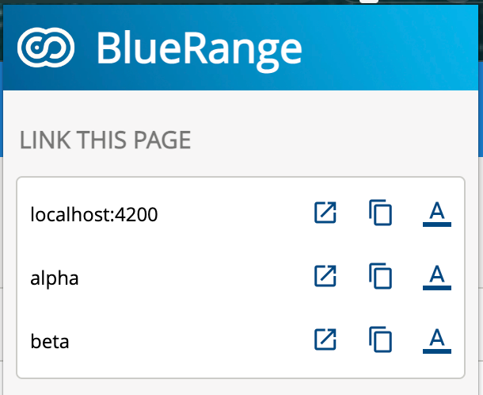
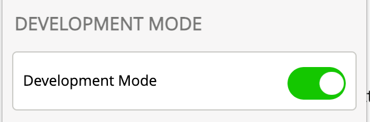
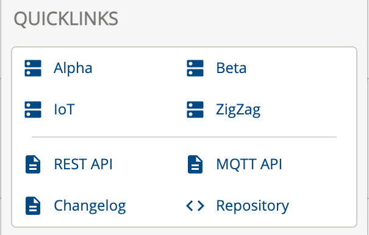

# BlueRange Portal Chrome Extension

This is a Chrome extension designed to support developers of the BlueRange portal.

## Overview

| image                        | description                                                                                                                                                                                                                                                                                 |
|------------------------------|---------------------------------------------------------------------------------------------------------------------------------------------------------------------------------------------------------------------------------------------------------------------------------------------|
|      | Manipulates the URL and changes the hostname accordingly.    Example:   https://beta.bluerange.io/#/setting/about?organization=000 --> https://localhost:4200/#/setting/about?organization=000     _Optionen_: open in new tab, copy raw link, copy markdown formatted link |
|  | Activate/Deactivate DevMode                                                                                                                                                                                                                                                                 |
|  | Usefull Quicklinks to Portal instances or further documentation.                                                                                                                                                                                                                            |

## Development

- Go to the Extensions page by entering [chrome://extensions](chrome://extensions) in a new tab
- Enable Developer Mode by clicking the toggle switch next to Developer mode
- Click the Load unpacked button and select the extension directory
- Select the root of this project

Reference: https://developer.chrome.com/docs/extensions/mv3/getstarted/development-basics/#load-unpacked